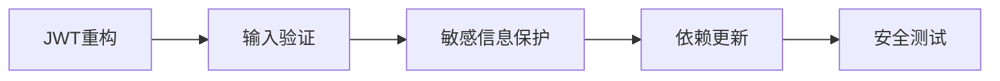

# HealthCheck 项目代码审查与改进分析报告

**项目版本**: Spring Boot 3.3.1 + Vue 3  
**审查日期**: 2024年12月  
**代码规模**: 后端 ~12,193 行 Java 代码 (104 文件), 前端 42 个 Vue/JS 文件  

---

## 执行摘要

本报告对 healthcheck 医疗健康管理平台进行了全面的代码审查。项目整体架构清晰，采用经典的三层架构（Controller-Service-Mapper），但在测试覆盖、安全性、性能优化和代码质量方面存在重大改进空间。

**关键发现**:
- 🔴 **严重**: 零测试覆盖率，JWT安全实现存在漏洞
- 🟡 **重要**: 前端存在多个高危依赖漏洞，缺少事务管理
- 🟢 **改进**: 代码结构良好，但需要优化性能和增强可维护性

---

## 1. 后端代码质量评估 (Spring Boot)

### 1.1 架构设计 ⭐⭐⭐⭐☆

**优点**:
- ✅ 清晰的三层架构（Controller → Service → Mapper）
- ✅ 合理的包结构划分（common、config、entity、exception等）
- ✅ 使用了全局异常处理器（GlobalExceptionHandler）
- ✅ 爬虫模块设计良好（Orchestrator、SourceClient、Normalizer、Deduplicator）

**问题**:
```java
// ❌ WebController.java - 控制器直接注入Mapper，违反分层原则
@Resource
ExaminationOrderMapper examinationOrderMapper;
@Resource
PhysicalExaminationMapper physicalExaminationMapper;
@Resource
ExaminationPackageMapper examinationPackageMapper;
```

**建议**: 所有数据库操作应通过Service层封装。

### 1.2 安全性问题 ⭐⭐☆☆☆ 

#### 🔴 严重安全漏洞

**1. JWT实现安全风险**
```java
// ❌ JWTInterceptor.java:70 - 使用用户密码作为HMAC密钥
JWTVerifier jwtVerifier = JWT.require(Algorithm.HMAC256(account.getPassword())).build();

// ❌ TokenUtils.java:54 - 同样问题
return JWT.create().withAudience(data)
    .withExpiresAt(DateUtil.offsetDay(new Date(), 1))
    .sign(Algorithm.HMAC256(sign)); // sign是用户密码
```

**风险**:
- 用户修改密码后，旧token仍然有效（密码未同步失效）
- 密码泄露 = JWT密钥泄露
- 无法统一撤销token

**推荐方案**:
```java
// ✅ 使用固定的应用级密钥
private static final String JWT_SECRET = System.getenv("JWT_SECRET"); // 从环境变量读取
Algorithm algorithm = Algorithm.HMAC256(JWT_SECRET);

// ✅ 在token中包含密码版本或时间戳
.withClaim("passwordVersion", user.getPasswordVersion())
```

**2. 缺少token赋值**
```java
// ❌ JWTInterceptor.java:41 - 获取token后未赋值
if (ObjectUtil.isNull(token)) {
    request.getParameter(Constants.TOKEN); // ⚠️ 返回值未使用！
}
```

**修复**:
```java
if (ObjectUtil.isNull(token)) {
    token = request.getParameter(Constants.TOKEN);
}
```

**3. 敏感信息暴露**
```yaml
# ❌ application.yml - 硬编码的数据库密码和API密钥
datasource:
  password: 2004  # 明文密码
api:
  key: "c0caa0c6b6164feea51e7c6dc4800b76.3VlyCD5XtuR83SHA"  # API密钥泄露
```

**建议**: 
- 使用环境变量或加密配置管理敏感信息
- 添加 `.env.example` 文件，排除 `.env` 文件

**4. 缺少输入验证**
```java
// ❌ 无任何Controller使用@Valid或@Validated
@PostMapping("/login")
public Result login(@RequestBody Account account) { // 未验证
    // ...
}
```

**建议**: 
```java
// ✅ 添加Bean Validation
@PostMapping("/login")
public Result login(@Valid @RequestBody LoginRequest request) {
    // ...
}

// LoginRequest类
public class LoginRequest {
    @NotBlank(message = "用户名不能为空")
    @Size(min = 3, max = 20)
    private String username;
    
    @NotBlank(message = "密码不能为空")
    @Size(min = 6, max = 20)
    private String password;
}
```

### 1.3 数据库与持久层 ⭐⭐⭐☆☆

**优点**:
- ✅ 使用MyBatis动态SQL
- ✅ HikariCP连接池配置合理
- ✅ 支持批量插入操作

**问题**:

**1. 零事务管理**
```java
// ❌ 未发现任何@Transactional注解
// 例如：MedicalLiteratureService.batchAdd() 批量插入无事务保护
public int batchAdd(List<MedicalLiterature> literatures) {
    for (MedicalLiterature literature : literatures) {
        medicalLiteratureMapper.insert(literature); // 单条插入，部分失败无法回滚
    }
}
```

**建议**:
```java
@Transactional(rollbackFor = Exception.class)
public int batchAdd(List<MedicalLiterature> literatures) {
    // ...
}
```

**2. N+1查询问题**
```java
// ❌ WebController.java:148-159 - 在循环中查询数据库
for (Title title : titleList) {
    Integer count = doctorService.selectByTitleId(title.getId()); // N次查询
}
```

**优化**:
```java
// ✅ 使用批量查询或JOIN
Map<Integer, Integer> countMap = doctorService.countByTitleIds(titleIds);
```

**3. 缺少数据库索引建议**
- 建议为 `MedicalLiterature` 表的 `title`、`source`、`category` 添加索引
- 为 `ExaminationOrder` 的 `createTime`、`status` 添加复合索引

### 1.4 缓存策略 ⭐⭐⭐☆☆

**优点**:
- ✅ 使用Spring Cache + Redis
- ✅ 自定义CacheService封装
- ✅ 统一的缓存键前缀管理

**问题**:
```java
// ❌ 只有3个服务使用了缓存注解
// MedicalLiteratureService、ExaminationPackageService、ExaminationOrderService

// ❌ 缺少缓存预热和失效策略
```

**建议**:
- 为热点查询添加缓存（用户信息、医生列表、体检套餐等）
- 实现缓存预热机制
- 添加缓存监控和清理策略

### 1.5 爬虫模块设计 ⭐⭐⭐⭐☆

**优点**:
- ✅ 良好的可扩展设计（SourceClient接口）
- ✅ 支持并行和串行两种模式
- ✅ 包含Normalizer和Deduplicator处理管道
- ✅ 详细的日志记录

**问题**:
```java
// ❌ Orchestrator.java:54 - 固定线程池未正确管理生命周期
private final ExecutorService executorService = Executors.newFixedThreadPool(4);

// ⚠️ shutdown()方法存在，但未被Spring容器调用
@PreDestroy // 缺少此注解
public void shutdown() {
    executorService.shutdown();
}
```

**建议**:
```java
@PreDestroy
public void shutdown() {
    // ...
}

// 或使用Spring管理的线程池
@Bean(name = "crawlerExecutor", destroyMethod = "shutdown")
public ExecutorService crawlerExecutor() {
    return new ThreadPoolExecutor(...);
}
```

### 1.6 Spring Cloud集成 ⭐⭐⭐☆☆

**优点**:
- ✅ 集成Resilience4j（熔断器）
- ✅ 集成Feign（服务间调用）
- ✅ 集成Actuator（监控）

**问题**:
```java
// ❌ 功能未实际使用
// @EnableEurekaClient 被注释掉
// 未发现任何@FeignClient接口定义
// 未发现任何@CircuitBreaker使用
```

**建议**: 
- 如果当前不需要微服务架构，移除相关依赖减少复杂度
- 或完善微服务配置，实现服务注册与发现

### 1.7 代码质量指标

| 指标 | 现状 | 目标 | 评级 |
|------|------|------|------|
| 代码复杂度 | 中等 | 低 | ⭐⭐⭐☆☆ |
| 命名规范 | 良好 | 优秀 | ⭐⭐⭐⭐☆ |
| 注释覆盖 | 30% | 60%+ | ⭐⭐☆☆☆ |
| 日志规范 | 良好 | 优秀 | ⭐⭐⭐⭐☆ |
| 异常处理 | 基本 | 完善 | ⭐⭐⭐☆☆ |

---

## 2. 前端代码质量评估 (Vue 3)

### 2.1 依赖安全问题 ⭐⭐☆☆☆

#### 🔴 高危漏洞

```bash
# npm audit 检测到的关键漏洞：

1. axios (1.0.0 - 1.11.0) - HIGH
   - DoS攻击风险
   - SSRF和凭证泄露风险
   
2. form-data (4.0.0 - 4.0.3) - CRITICAL
   - 不安全的随机函数
   
3. element-plus (<=2.11.0) - MODERATE
   - el-link组件输入验证不足
   
4. @babel/runtime (<7.26.10) - MODERATE
   - 低效的正则表达式复杂度
```

**修复建议**:
```bash
# 立即执行
npm audit fix

# 手动更新关键依赖
npm install axios@latest element-plus@latest
```

### 2.2 构建配置 ⭐⭐⭐☆☆

**问题**:
```javascript
// ❌ vite.config.js:37-97 - 过度详细的optimizeDeps配置
optimizeDeps: {
  include: [
    "element-plus/es/components/base/style/css",
    "element-plus/es/components/message/style/css",
    // ... 60行配置
  ]
}
```

**问题**: 
- Vite 3+ 自动处理依赖预构建，此配置可能过时
- 增加维护负担
- 可能导致构建问题

**建议**:
```javascript
// ✅ 简化配置，让Vite自动优化
optimizeDeps: {
  include: ['vue', 'vue-router', 'axios', 'element-plus', 'echarts']
}
```

### 2.3 代码质量 ⭐⭐⭐☆☆

**问题**:

**1. 大量console.log**
```javascript
// ❌ 21个文件中包含console.log或console.error
// 示例：Login.vue, Home.vue, AiConsultation.vue等
console.log('用户信息:', user)  // 生产环境应移除
```

**建议**:
```javascript
// ✅ 使用统一的logger工具（已存在logger.js，但未充分使用）
import logger from '@/utils/logger'
logger.info('用户信息:', user)

// ✅ 在build时自动移除
// vite.config.js
export default defineConfig({
  esbuild: {
    drop: process.env.NODE_ENV === 'production' ? ['console', 'debugger'] : []
  }
})
```

**2. 缺少状态管理**
```javascript
// ❌ 使用localStorage直接管理用户状态
let user = JSON.parse(localStorage.getItem("xm-user") || '{}')
```

**建议**: 引入Pinia进行状态管理，统一管理用户会话、权限等。

**3. 路由守卫缺失**
```javascript
// ❌ router/index.js 无权限验证
// 任何人都可以访问 /manager 路由
```

**建议**:
```javascript
router.beforeEach((to, from, next) => {
  const user = JSON.parse(localStorage.getItem('xm-user') || '{}')
  if (to.path.startsWith('/manager') && !user.token) {
    next('/login')
  } else {
    next()
  }
})
```

### 2.4 性能优化建议

**1. 组件懒加载** ✅（已实现）
```javascript
// ✅ 使用了动态import
component: () => import('@/views/Manager.vue')
```

**2. 图片优化** ❌（待改进）
- 建议使用WebP格式
- 添加图片懒加载（vue-lazyload）

**3. 打包优化**
```javascript
// ✅ 建议添加分包配置
build: {
  rollupOptions: {
    output: {
      manualChunks: {
        'element-plus': ['element-plus'],
        'echarts': ['echarts'],
        'editor': ['@wangeditor/editor', '@wangeditor/editor-for-vue']
      }
    }
  }
}
```

---

## 3. 测试覆盖与质量保证 ⭐☆☆☆☆

### 3.1 测试现状

**后端**:
```bash
# ❌ 零测试覆盖
find . -name "*Test.java" | wc -l
# 0
```

**前端**:
```json
// ❌ package.json 无测试脚本
"scripts": {
  "dev": "vite",
  "build": "vite build",
  "preview": "vite preview"
  // 缺少 "test": "vitest"
}
```

### 3.2 测试策略建议

**后端测试框架**:
```xml
<!-- pom.xml 添加依赖 -->
<dependency>
    <groupId>org.springframework.boot</groupId>
    <artifactId>spring-boot-starter-test</artifactId>
    <scope>test</scope>
</dependency>
<dependency>
    <groupId>com.h2database</groupId>
    <artifactId>h2</artifactId>
    <scope>test</scope>
</dependency>
```

**优先级测试覆盖**:
1. **高优先级**: JWTInterceptor、TokenUtils（安全相关）
2. **中优先级**: Service层业务逻辑（MedicalLiteratureService、AiConsultationService）
3. **低优先级**: Controller层集成测试

**示例单元测试**:
```java
@SpringBootTest
class MedicalLiteratureServiceTest {
    
    @Autowired
    private MedicalLiteratureService literatureService;
    
    @Test
    void testBatchAdd_ShouldHandleDuplicates() {
        // Given
        List<MedicalLiterature> papers = Arrays.asList(
            createPaper("Test Paper 1"),
            createPaper("Test Paper 1") // 重复
        );
        
        // When
        int savedCount = literatureService.batchAdd(papers);
        
        // Then
        assertEquals(1, savedCount);
    }
}
```

**前端测试框架**:
```json
{
  "devDependencies": {
    "vitest": "^1.0.0",
    "@vue/test-utils": "^2.4.0",
    "happy-dom": "^12.0.0"
  }
}
```

---

## 4. 性能优化机会

### 4.1 数据库优化 ⭐⭐⭐☆☆

**1. 慢查询问题**
```java
// ❌ WebController.java:101 - 全表扫描
List<ExaminationOrder> examinationorders = examinationOrderMapper.selectAll(null);
```

**建议**:
- 添加分页查询
- 只查询需要的字段
- 添加缓存

**2. 批量操作优化**
```xml
<!-- ✅ UserMapper.xml:44 已实现批量插入 -->
<insert id="batchInsert">
    insert into `user` (username, password, ...) values
    <foreach collection="users" item="u" separator=",">
        (#{u.username}, #{u.password}, ...)
    </foreach>
</insert>
```

**建议**: 为其他Mapper也添加批量操作方法。

**3. 索引建议**
```sql
-- ✅ 推荐添加的索引
CREATE INDEX idx_medical_literature_title ON medical_literature(title);
CREATE INDEX idx_medical_literature_source ON medical_literature(source);
CREATE INDEX idx_medical_literature_category ON medical_literature(category);
CREATE INDEX idx_examination_order_time_status ON examination_order(create_time, status);
CREATE INDEX idx_user_username ON user(username);
```

### 4.2 缓存优化

**当前缓存覆盖率**: ~15%  
**目标缓存覆盖率**: 60%+

**建议增加缓存的场景**:
```java
// ✅ 用户信息缓存
@Cacheable(value = "users", key = "#id")
public User selectById(Integer id) { ... }

// ✅ 医生列表缓存
@Cacheable(value = "doctors", key = "'all'")
public List<Doctor> selectAll() { ... }

// ✅ 体检套餐缓存
@Cacheable(value = "packages", key = "'active'")
public List<ExaminationPackage> getActivePackages() { ... }
```

### 4.3 API响应时间优化

**当前问题**:
- 爬虫接口可能超时（30秒）
- 统计接口查询全表数据

**建议**:
1. **异步处理**: 爬虫任务改为异步执行，返回任务ID
```java
@Async
public CompletableFuture<CrawlResult> crawlAsync(CrawlRequest request) {
    // ...
}
```

2. **接口限流**: 使用Resilience4j的RateLimiter
```java
@RateLimiter(name = "crawlerAPI", fallbackMethod = "crawlFallback")
public CrawlResult crawl(CrawlRequest request) {
    // ...
}
```

3. **数据库连接池优化** ✅（已配置HikariCP）

---

## 5. 技术债识别

### 5.1 后端技术债

| 优先级 | 技术债项目 | 影响范围 | 估算工作量 |
|--------|-----------|---------|-----------|
| 🔴 高 | JWT安全漏洞修复 | 全局 | 2-3天 |
| 🔴 高 | 添加事务管理 | Service层 | 2天 |
| 🔴 高 | 输入验证机制 | Controller层 | 3天 |
| 🟡 中 | 测试覆盖率提升 | 全局 | 2周 |
| 🟡 中 | 循环依赖问题 | 配置层 | 1天 |
| 🟢 低 | Spring Cloud组件清理 | 依赖 | 1天 |

**循环依赖问题**:
```yaml
# ❌ application.yml:7
spring:
  main:
    allow-circular-references: true  # 应消除循环依赖，而非允许
```

### 5.2 前端技术债

| 优先级 | 技术债项目 | 影响范围 | 估算工作量 |
|--------|-----------|---------|-----------|
| 🔴 高 | 依赖安全漏洞修复 | 全局 | 1天 |
| 🟡 中 | 状态管理引入Pinia | 全局 | 2-3天 |
| 🟡 中 | 路由权限守卫 | 路由层 | 1天 |
| 🟡 中 | Console.log清理 | 全局 | 1天 |
| 🟢 低 | Vite配置简化 | 构建 | 0.5天 |

### 5.3 依赖过时检查

**后端**:
```xml
<!-- ⚠️ 可能需要更新的依赖 -->
<dependency>
    <groupId>cn.hutool</groupId>
    <artifactId>hutool-all</artifactId>
    <version>5.8.25</version> <!-- 检查最新版本 -->
</dependency>
```

**前端**:
```json
{
  "dependencies": {
    "three": "^0.134.0",  // ⚠️ 版本较旧，最新为 0.160+
    "vanta": "^0.5.24"    // ⚠️ 可能不再维护
  }
}
```

---

## 6. 安全性审查总结

### 6.1 OWASP Top 10 检查

| 风险类型 | 状态 | 发现 |
|---------|------|------|
| A01:失效的访问控制 | 🟡 | JWT实现有缺陷，但有基本鉴权 |
| A02:加密失败 | 🔴 | 密码明文存储于配置文件 |
| A03:注入 | 🟡 | 使用MyBatis参数化查询，但缺少输入验证 |
| A04:不安全设计 | 🟡 | 缺少测试，API无限流 |
| A05:安全配置错误 | 🔴 | 允许循环依赖，暴露敏感日志 |
| A06:易受攻击的组件 | 🔴 | 前端多个高危依赖 |
| A07:身份识别和认证失败 | 🔴 | JWT使用密码作为密钥 |
| A08:软件和数据完整性失败 | 🟢 | 基本符合 |
| A09:安全日志和监控失败 | 🟡 | 有日志但缺少安全审计 |
| A10:服务端请求伪造 | 🟢 | 未发现明显问题 |

### 6.2 安全加固建议

**1. 实现完整的认证授权体系**
```java
// ✅ 建议使用Spring Security
@Configuration
@EnableWebSecurity
public class SecurityConfig extends WebSecurityConfigurerAdapter {
    @Override
    protected void configure(HttpSecurity http) throws Exception {
        http.csrf().disable()
            .authorizeRequests()
            .antMatchers("/login", "/register").permitAll()
            .antMatchers("/manager/**").hasRole("ADMIN")
            .anyRequest().authenticated()
            .and()
            .addFilterBefore(jwtAuthenticationFilter, UsernamePasswordAuthenticationFilter.class);
    }
}
```

**2. 敏感数据加密**
```java
// ✅ 使用Spring Crypto
@Bean
public TextEncryptor textEncryptor() {
    return Encryptors.text(
        System.getenv("ENCRYPT_PASSWORD"),
        System.getenv("ENCRYPT_SALT")
    );
}
```

**3. API限流和防护**
```yaml
# ✅ application.yml
resilience4j:
  ratelimiter:
    instances:
      crawlerAPI:
        limit-for-period: 10
        limit-refresh-period: 1m
```

---

## 7. 可扩展性与架构评估

### 7.1 当前架构 ⭐⭐⭐⭐☆

**优点**:
- ✅ 单体应用架构合理，适合当前规模
- ✅ 爬虫模块高度可扩展（易于添加新数据源）
- ✅ 预留了微服务扩展能力（Spring Cloud依赖）

**架构图**:
```
┌─────────────────────────────────────────────────┐
│               Vue 3 Frontend                    │
│  (Element Plus + Vue Router + Axios)            │
└─────────────────┬───────────────────────────────┘
                  │ HTTP/REST
┌─────────────────▼───────────────────────────────┐
│          Spring Boot Backend                    │
│  ┌──────────────────────────────────────────┐   │
│  │  Controller Layer (REST APIs)            │   │
│  └──────────────┬───────────────────────────┘   │
│  ┌──────────────▼───────────────────────────┐   │
│  │  Service Layer (Business Logic)          │   │
│  │  - JWT Authentication                     │   │
│  │  - AI Consultation                        │   │
│  │  - Crawler Orchestrator                   │   │
│  └──────────────┬───────────────────────────┘   │
│  ┌──────────────▼───────────────────────────┐   │
│  │  Mapper Layer (MyBatis)                   │   │
│  └──────────────┬───────────────────────────┘   │
└─────────────────┼───────────────────────────────┘
                  │
    ┌─────────────┼─────────────┐
    │             │             │
┌───▼───┐   ┌─────▼─────┐   ┌──▼───┐
│ MySQL │   │   Redis   │   │ RMQ  │
└───────┘   └───────────┘   └──────┘
```

### 7.2 爬虫模块可扩展性 ⭐⭐⭐⭐⭐

**优秀设计**:
```java
// ✅ 接口设计清晰
public interface SourceClient {
    String getSourceName();
    List<MedicalLiterature> fetch(String keyword, int maxResults);
    boolean isAvailable();
}

// ✅ 易于添加新数据源
@Service
public class NewMedicalSource implements SourceClient {
    @Override
    public String getSourceName() { return "new-source"; }
    
    @Override
    public List<MedicalLiterature> fetch(String keyword, int maxResults) {
        // 实现爬取逻辑
    }
}
```

**建议**: 考虑将爬虫模块独立为微服务，支持水平扩展。

### 7.3 水平扩展能力

**当前限制**:
1. ❌ Session存储在内存（需改为Redis）
2. ❌ 定时任务无分布式协调（ScheduledTaskService）
3. ✅ 数据库连接池支持扩展
4. ✅ Redis支持集群模式

**微服务拆分建议**:
```
建议的微服务拆分：
1. user-service: 用户管理（Admin、User、Doctor）
2. exam-service: 体检业务（Order、Package、PhysicalExamination）
3. literature-service: 文献管理 + 爬虫
4. ai-service: AI咨询服务
5. gateway: API网关（统一鉴权、限流）
```

---

## 8. 优先级改进建议

### 8.1 立即修复（1周内）🔴

1. **JWT安全漏洞修复**
   - 使用固定密钥替代密码
   - 修复token参数赋值问题
   - 添加token黑名单机制

2. **敏感信息保护**
   - 迁移密码和API密钥到环境变量
   - 创建`.env.example`模板

3. **前端依赖更新**
   ```bash
   npm audit fix
   npm update axios element-plus
   ```

4. **添加输入验证**
   - 引入Bean Validation
   - 为所有Controller添加@Valid

### 8.2 短期改进（2-4周）🟡

1. **测试覆盖**
   - 核心Service层单元测试：60%+
   - Controller层集成测试：40%+
   - E2E测试：关键业务流程

2. **事务管理**
   - 为所有写操作添加@Transactional
   - 配置事务传播机制

3. **性能优化**
   - 添加数据库索引
   - 扩大缓存覆盖范围
   - 优化N+1查询

4. **前端改进**
   - 引入Pinia状态管理
   - 添加路由守卫
   - 清理console.log

### 8.3 中期规划（1-3月）🟢

1. **架构优化**
   - 评估微服务拆分必要性
   - 引入Spring Security替换自定义JWT
   - 实现分布式定时任务（XXL-Job）

2. **监控体系**
   - 完善Actuator监控指标
   - 接入APM工具（SkyWalking/Pinpoint）
   - 配置日志聚合（ELK）

3. **文档完善**
   - API文档（Swagger已集成）
   - 架构设计文档
   - 运维手册

### 8.4 长期优化（3-6月）🔵

1. **DevOps实践**
   - CI/CD流水线（GitLab CI / GitHub Actions）
   - 容器化部署（Docker + K8s）
   - 自动化测试集成

2. **高可用架构**
   - 数据库主从复制
   - Redis集群
   - 负载均衡

---

## 9. 重构路线图

### Phase 1: 安全加固（优先级最高）

**预计工期**: 1-2周  
**风险**: 低  
**影响**: 高

### Phase 2: 质量提升

**预计工期**: 3-4周  
**风险**: 低  
**影响**: 中

### Phase 3: 性能优化

**预计工期**: 2-3周  
**风险**: 低  
**影响**: 中

### Phase 4: 架构演进

**预计工期**: 2-3月  
**风险**: 高  
**影响**: 高

---

## 10. 具体实施方案

### 10.1 JWT安全修复方案

**实施步骤**:

1. **创建JWT配置类**
```java
@Configuration
public class JwtConfig {
    @Value("${jwt.secret}")
    private String secret;
    
    @Value("${jwt.expiration:86400000}") // 默认24小时
    private Long expiration;
    
    @Bean
    public Algorithm jwtAlgorithm() {
        return Algorithm.HMAC256(secret);
    }
}
```

2. **修改TokenUtils**
```java
@Component
public class TokenUtils {
    @Autowired
    private Algorithm jwtAlgorithm;
    
    public String createToken(Account account) {
        return JWT.create()
            .withSubject(account.getId().toString())
            .withClaim("role", account.getRole())
            .withClaim("username", account.getUsername())
            .withIssuedAt(new Date())
            .withExpiresAt(new Date(System.currentTimeMillis() + expiration))
            .sign(jwtAlgorithm);
    }
    
    public DecodedJWT verifyToken(String token) {
        JWTVerifier verifier = JWT.require(jwtAlgorithm).build();
        return verifier.verify(token);
    }
}
```

3. **更新JWTInterceptor**
```java
@Component
public class JWTInterceptor implements HandlerInterceptor {
    @Autowired
    private TokenUtils tokenUtils;
    
    @Override
    public boolean preHandle(HttpServletRequest request, HttpServletResponse response, Object handler) {
        String token = request.getHeader(Constants.TOKEN);
        if (token == null) {
            token = request.getParameter(Constants.TOKEN);
        }
        
        if (token == null) {
            throw new CustomException(ResultCodeEnum.TOKEN_INVALID_ERROR);
        }
        
        try {
            DecodedJWT jwt = tokenUtils.verifyToken(token);
            // 将用户信息存入请求属性
            request.setAttribute("userId", jwt.getSubject());
            request.setAttribute("role", jwt.getClaim("role").asString());
            return true;
        } catch (Exception e) {
            throw new CustomException(ResultCodeEnum.TOKEN_CHECK_ERROR);
        }
    }
}
```

4. **配置环境变量**
```yaml
# application.yml
jwt:
  secret: ${JWT_SECRET:your-secret-key-change-in-production}
  expiration: 86400000 # 24小时
```

```bash
# .env (不提交到Git)
JWT_SECRET=your-very-secure-random-string-here
```

**测试计划**:
- [ ] 验证登录后token生成正确
- [ ] 验证token过期后返回401
- [ ] 验证修改密码后旧token仍可用（符合预期）
- [ ] 压力测试：1000并发请求验证token

### 10.2 数据库优化方案

**SQL优化脚本**:
```sql
-- 1. 添加索引
ALTER TABLE medical_literature 
ADD INDEX idx_title (title(100)),
ADD INDEX idx_source (source),
ADD INDEX idx_category (category),
ADD INDEX idx_create_time (create_time);

ALTER TABLE examination_order
ADD INDEX idx_status_time (status, create_time),
ADD INDEX idx_user_id (user_id);

ALTER TABLE user
ADD INDEX idx_username (username);

-- 2. 分析表性能
ANALYZE TABLE medical_literature;
ANALYZE TABLE examination_order;

-- 3. 检查慢查询
SELECT * FROM mysql.slow_log 
WHERE start_time > DATE_SUB(NOW(), INTERVAL 1 HOUR)
ORDER BY query_time DESC LIMIT 10;
```

**MyBatis优化**:
```xml
<!-- ✅ 添加分页查询 -->
<select id="selectAllWithPagination" resultType="MedicalLiterature">
    SELECT id, title, authors, source, category, create_time
    FROM medical_literature
    <where>
        <if test="status != null">status = #{status}</if>
        <if test="source != null">AND source = #{source}</if>
    </where>
    ORDER BY create_time DESC
    LIMIT #{offset}, #{limit}
</select>

<!-- ✅ 避免SELECT * -->
<select id="selectEssentialFields" resultType="User">
    SELECT id, username, name, role, avatar
    FROM user
    WHERE status = 'active'
</select>
```

### 10.3 前端优化方案

**Vite配置优化**:
```javascript
// vite.config.js
export default defineConfig({
  plugins: [vue(), AutoImport(...), Components(...)],
  
  // ✅ 简化optimizeDeps
  optimizeDeps: {
    include: ['vue', 'vue-router', 'axios', 'element-plus', 'echarts']
  },
  
  // ✅ 构建优化
  build: {
    target: 'es2015',
    minify: 'terser',
    terserOptions: {
      compress: {
        drop_console: true,
        drop_debugger: true
      }
    },
    rollupOptions: {
      output: {
        manualChunks: {
          'element-ui': ['element-plus'],
          'charts': ['echarts'],
          'editor': ['@wangeditor/editor', '@wangeditor/editor-for-vue']
        }
      }
    },
    chunkSizeWarningLimit: 1000
  },
  
  // ✅ 生产环境移除console
  esbuild: {
    drop: process.env.NODE_ENV === 'production' ? ['console', 'debugger'] : []
  }
})
```

**性能监控代码**:
```javascript
// src/utils/performance.js
export function initPerformanceMonitor() {
  if (process.env.NODE_ENV === 'production') {
    window.addEventListener('load', () => {
      const perfData = window.performance.timing;
      const pageLoadTime = perfData.loadEventEnd - perfData.navigationStart;
      const connectTime = perfData.responseEnd - perfData.requestStart;
      
      console.log('页面加载时间:', pageLoadTime + 'ms');
      console.log('请求响应时间:', connectTime + 'ms');
      
      // 发送到监控服务
      // sendToMonitoring({ pageLoadTime, connectTime });
    });
  }
}
```

---

## 11. 代码示例与最佳实践

### 11.1 Service层最佳实践

```java
/**
 * 医疗文献服务 - 最佳实践示例
 */
@Service
@Slf4j
public class MedicalLiteratureService {
    
    @Autowired
    private MedicalLiteratureMapper mapper;
    
    @Autowired
    private CacheService cacheService;
    
    /**
     * 批量添加文献
     * 
     * @param literatures 文献列表
     * @return 成功添加的数量
     * @throws ServiceException 业务异常
     */
    @Transactional(rollbackFor = Exception.class)
    @CacheEvict(value = "literatures", allEntries = true)
    public int batchAdd(@Valid List<MedicalLiterature> literatures) {
        // 1. 参数验证
        if (CollectionUtils.isEmpty(literatures)) {
            throw new ServiceException("文献列表不能为空");
        }
        
        // 2. 去重处理
        List<MedicalLiterature> uniqueLiteratures = deduplicateByTitle(literatures);
        
        // 3. 批量插入
        try {
            return mapper.batchInsert(uniqueLiteratures);
        } catch (DuplicateKeyException e) {
            log.warn("批量插入时发现重复键: {}", e.getMessage());
            // 回退到单条插入
            return insertOneByOne(uniqueLiteratures);
        }
    }
    
    /**
     * 分页查询文献
     */
    @Cacheable(value = "literatures", key = "#page + '-' + #size + '-' + #category")
    public PageInfo<MedicalLiterature> findByPage(int page, int size, String category) {
        PageHelper.startPage(page, size);
        List<MedicalLiterature> list = mapper.selectByCategory(category);
        return new PageInfo<>(list);
    }
    
    private List<MedicalLiterature> deduplicateByTitle(List<MedicalLiterature> literatures) {
        return literatures.stream()
            .collect(Collectors.toMap(
                MedicalLiterature::getTitle,
                Function.identity(),
                (existing, replacement) -> existing
            ))
            .values()
            .stream()
            .collect(Collectors.toList());
    }
}
```

### 11.2 Controller层最佳实践

```java
/**
 * 医疗文献控制器 - 最佳实践示例
 */
@RestController
@RequestMapping("/api/literature")
@Validated
@Slf4j
public class MedicalLiteratureController {
    
    @Autowired
    private MedicalLiteratureService literatureService;
    
    /**
     * 分页查询文献
     * 
     * @param page 页码（从1开始）
     * @param size 每页大小
     * @param category 分类（可选）
     * @return 分页结果
     */
    @GetMapping
    @ApiOperation("分页查询医疗文献")
    public Result<PageInfo<MedicalLiterature>> findByPage(
            @RequestParam(defaultValue = "1") @Min(1) Integer page,
            @RequestParam(defaultValue = "10") @Min(1) @Max(100) Integer size,
            @RequestParam(required = false) String category) {
        
        log.info("分页查询文献: page={}, size={}, category={}", page, size, category);
        
        PageInfo<MedicalLiterature> pageInfo = literatureService.findByPage(page, size, category);
        return Result.success(pageInfo);
    }
    
    /**
     * 添加文献
     */
    @PostMapping
    @ApiOperation("添加单个医疗文献")
    public Result<Void> add(@Valid @RequestBody LiteratureAddRequest request) {
        log.info("添加文献: {}", request.getTitle());
        
        MedicalLiterature literature = convertToEntity(request);
        literatureService.add(literature);
        
        return Result.success();
    }
    
    /**
     * 异常处理示例
     */
    @ExceptionHandler(MethodArgumentNotValidException.class)
    public Result<Void> handleValidationException(MethodArgumentNotValidException e) {
        String errorMsg = e.getBindingResult().getFieldErrors().stream()
            .map(error -> error.getField() + ": " + error.getDefaultMessage())
            .collect(Collectors.joining(", "));
        
        log.warn("参数验证失败: {}", errorMsg);
        return Result.error("400", errorMsg);
    }
}
```

### 11.3 前端最佳实践

```vue
<!-- MedicalLiterature.vue - 最佳实践示例 -->
<template>
  <div class="literature-container">
    <el-card>
      <!-- 搜索区 -->
      <el-form :model="searchForm" inline>
        <el-form-item label="分类">
          <el-select v-model="searchForm.category" clearable>
            <el-option label="全部" value=""></el-option>
            <el-option label="心血管" value="cardiovascular"></el-option>
          </el-select>
        </el-form-item>
        <el-form-item>
          <el-button type="primary" @click="handleSearch">搜索</el-button>
        </el-form-item>
      </el-form>
      
      <!-- 表格 -->
      <el-table :data="tableData" v-loading="loading">
        <el-table-column prop="title" label="标题" show-overflow-tooltip/>
        <el-table-column prop="authors" label="作者" width="150"/>
        <el-table-column prop="source" label="来源" width="100"/>
        <el-table-column label="操作" width="150">
          <template #default="scope">
            <el-button size="small" @click="handleView(scope.row)">查看</el-button>
          </template>
        </el-table-column>
      </el-table>
      
      <!-- 分页 -->
      <el-pagination
        v-model:current-page="pagination.page"
        v-model:page-size="pagination.size"
        :total="pagination.total"
        @current-change="handlePageChange"
        layout="total, prev, pager, next, jumper"
      />
    </el-card>
  </div>
</template>

<script setup>
import { ref, reactive, onMounted } from 'vue'
import request from '@/utils/request'
import { ElMessage } from 'element-plus'
import logger from '@/utils/logger'

// 响应式数据
const loading = ref(false)
const tableData = ref([])
const searchForm = reactive({
  category: ''
})
const pagination = reactive({
  page: 1,
  size: 10,
  total: 0
})

// 加载数据
const loadData = async () => {
  loading.value = true
  try {
    const params = {
      page: pagination.page,
      size: pagination.size,
      category: searchForm.category
    }
    
    const res = await request.get('/api/literature', { params })
    
    if (res.code === '200') {
      tableData.value = res.data.list
      pagination.total = res.data.total
    } else {
      ElMessage.error(res.msg || '加载失败')
    }
  } catch (error) {
    logger.error('加载文献失败:', error)
    ElMessage.error('加载失败')
  } finally {
    loading.value = false
  }
}

// 事件处理
const handleSearch = () => {
  pagination.page = 1
  loadData()
}

const handlePageChange = (page) => {
  pagination.page = page
  loadData()
}

const handleView = (row) => {
  // 跳转到详情页
  router.push(`/literature/${row.id}`)
}

// 生命周期
onMounted(() => {
  loadData()
})
</script>

<style scoped>
.literature-container {
  padding: 20px;
}
</style>
```

---

## 12. 结论与行动计划

### 12.1 总体评价

HealthCheck项目展现了**良好的架构设计基础**，特别是在爬虫模块的可扩展性设计上。但在**安全性、测试覆盖和代码质量**方面存在明显短板。

**总体评分**: ⭐⭐⭐☆☆ (3/5)

| 维度 | 评分 | 权重 | 加权分 |
|------|------|------|--------|
| 架构设计 | 4/5 | 20% | 0.8 |
| 代码质量 | 3/5 | 15% | 0.45 |
| 安全性 | 2/5 | 25% | 0.5 |
| 性能 | 3/5 | 15% | 0.45 |
| 测试覆盖 | 1/5 | 15% | 0.15 |
| 可维护性 | 3/5 | 10% | 0.3 |
| **总分** | - | 100% | **2.65/5** |

### 12.2 30天行动计划

#### Week 1: 安全加固 🔒
- [ ] **Day 1-2**: JWT重构（使用固定密钥）
- [ ] **Day 3**: 敏感信息迁移到环境变量
- [ ] **Day 4-5**: 添加Bean Validation输入验证
- [ ] **Day 6**: 前端依赖安全更新
- [ ] **Day 7**: 安全测试与验证

#### Week 2: 质量提升 📈
- [ ] **Day 8-10**: 编写核心Service层单元测试（目标30个测试用例）
- [ ] **Day 11-12**: 添加事务管理注解
- [ ] **Day 13**: Controller层集成测试
- [ ] **Day 14**: 代码审查与重构

#### Week 3: 性能优化 ⚡
- [ ] **Day 15-16**: 数据库索引优化
- [ ] **Day 17-18**: 扩展缓存覆盖范围
- [ ] **Day 19**: 修复N+1查询问题
- [ ] **Day 20**: 前端打包优化
- [ ] **Day 21**: 性能测试与压测

#### Week 4: 规范与文档 📚
- [ ] **Day 22-23**: 清理console.log，统一日志规范
- [ ] **Day 24**: 前端路由守卫实现
- [ ] **Day 25-26**: API文档完善（Swagger）
- [ ] **Day 27**: 编写部署文档
- [ ] **Day 28**: 代码规范文档
- [ ] **Day 29**: 内部培训与知识分享
- [ ] **Day 30**: 最终代码审查与发布

### 12.3 成功指标 (KPI)

| 指标 | 当前值 | 30天目标 | 90天目标 |
|------|--------|----------|----------|
| 单元测试覆盖率 | 0% | 40% | 70% |
| 安全漏洞数 | 8+ | 0 | 0 |
| API响应时间(P95) | ~2s | <500ms | <300ms |
| 代码重复率 | 未知 | <5% | <3% |
| 前端打包大小 | 未知 | <1MB | <800KB |
| Lighthouse分数 | 未知 | 80+ | 90+ |

### 12.4 风险提示

1. **技术债风险**: 如不及时处理JWT安全问题，可能导致数据泄露
2. **测试风险**: 零测试覆盖使重构工作风险较高
3. **性能风险**: 数据量增长可能导致查询性能急剧下降
4. **合规风险**: 医疗健康数据处理需满足隐私保护法规（HIPAA/GDPR）

### 12.5 资源需求

- **开发人员**: 2-3名全职开发（1后端 + 1前端 + 1测试）
- **时间投入**: 
  - 紧急修复：40人时
  - 短期改进：160人时
  - 中期规划：320人时
- **工具支持**:
  - 测试框架：JUnit 5, Mockito, Vitest
  - 代码质量：SonarQube
  - 性能监控：Grafana + Prometheus
  - CI/CD：GitLab CI / GitHub Actions

---

## 13. 附录

### 13.1 关键文件清单

**需要立即修复的文件**:
```
springboot/src/main/java/com/example/
├── common/config/JWTInterceptor.java          (JWT漏洞)
├── utils/TokenUtils.java                       (JWT密钥)
├── controller/WebController.java               (分层违规)
└── crawler/core/Orchestrator.java              (线程池)

springboot/src/main/resources/
└── application.yml                             (敏感信息)

vue/vue/
├── package.json                                (依赖更新)
├── src/router/index.js                         (路由守卫)
└── vite.config.js                              (构建优化)
```

### 13.2 参考资料

- [OWASP Top 10](https://owasp.org/www-project-top-ten/)
- [Spring Security最佳实践](https://spring.io/guides/topicals/spring-security-architecture/)
- [MyBatis性能优化](https://mybatis.org/mybatis-3/performance.html)
- [Vue 3性能优化指南](https://vuejs.org/guide/best-practices/performance.html)
- [阿里巴巴Java开发手册](https://github.com/alibaba/p3c)

### 13.3 审查工具推荐

- **代码质量**: SonarQube, ESLint, Prettier
- **安全扫描**: OWASP Dependency-Check, Snyk
- **性能分析**: JProfiler, Chrome DevTools
- **测试覆盖**: JaCoCo, Istanbul

---

**报告编制**: AI Code Review Agent  
**审查范围**: HealthCheck项目全栈代码  
**审查时间**: 2024年12月  
**建议有效期**: 3个月（需定期复审）

---

## 联系与反馈

如对本报告有任何疑问或需要进一步的技术支持，请联系项目负责人或开发团队。

**下次审查建议**: 3个月后或完成主要修复项后
