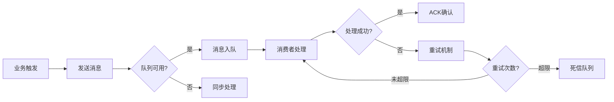

# 🏥 智慧医疗健康管理平台

一个基于Spring Boot 3.3.1 + Vue 3的现代化分布式医疗健康管理系统，集成了智能爬虫、分布式缓存、消息队列、性能监控等企业级技术栈，支持多角色协同的完整医疗服务流程。

## 🎯 项目亮点

### 🏗️ 现代化技术栈
- **后端架构**: Spring Boot 3.3.1 + MyBatis + MySQL 8.0 + Java 17
- **前端技术**: Vue 3.4.29 + Element Plus 2.8.4 + Vite 5.3.1
- **分布式缓存**: Redis + Lettuce连接池 + 分布式锁
- **消息队列**: RabbitMQ + 死信队列 + 容错降级
- **认证授权**: JWT Token + 角色权限控制
- **API文档**: OpenAPI 3.0 + Swagger UI
- **监控体系**: Spring Boot Actuator + 自定义监控

### 🕷️ 智能文献爬虫系统
- **多数据源支持**: arXiv、PubMed、IEEE等学术数据库
- **智能解析引擎**: 自动提取标题、作者、摘要、关键词
- **异步处理架构**: 基于RabbitMQ的消息驱动爬取
- **容错与降级**: 网络异常自动重试，服务降级保护
- **数据质量保证**: 去重算法、数据清洗、格式标准化
- **性能监控**: 爬取速度、成功率、错误统计实时监控

### 🔒 分布式缓存优化
- **缓存击穿防护**: Redis分布式锁 + 双重检查机制
- **缓存穿透防护**: 布隆过滤器 + 空值缓存策略
- **缓存雪崩防护**: 随机过期时间 + 热点数据预热
- **声明式缓存**: @Cacheable/@CachePut/@CacheEvict注解
- **缓存命中率优化**: 多级缓存 + 智能预加载

### 🔄 消息驱动架构
- **异步业务解耦**: 体检报告生成、邮件通知、数据同步
- **可靠消息投递**: 手动ACK + 死信队列 + 重试机制
- **优雅降级处理**: 消息队列不可用时自动切换同步模式
- **Topic路由**: 基于业务类型的智能消息路由

## 🚀 快速启动

### 1. 环境要求
- **Java**: JDK 17+ (推荐OpenJDK 17)
- **Node.js**: 16+ (推荐18.x LTS)
- **Maven**: 3.6+
- **MySQL**: 8.0+ (必需，端口3306)
- **Redis**: 6.0+ (可选，端口6379，支持动态开关)
- **RabbitMQ**: 3.8+ (可选，端口5672，支持容错降级)

### 2. 数据库初始化
```bash
# 1. 创建数据库
mysql -u root -p
CREATE DATABASE health CHARACTER SET utf8mb4 COLLATE utf8mb4_unicode_ci;

# 2. 导入数据表
mysql -u root -p health < sql/health.sql
```

### 3. 一键启动
```bash
# Windows用户 - 推荐方式
start-system.bat

# 或手动启动
cd springboot && mvn spring-boot:run
cd vue/vue && npm run dev
```

### 4. 访问地址
- **前端界面**: http://localhost:5173 (Vue开发服务器)
- **后端API**: http://localhost:9090 (Spring Boot应用)
- **API文档**: http://localhost:9090/swagger-ui.html
- **健康检查**: http://localhost:9090/actuator/health
- **系统监控**: http://localhost:9090/system/status
- **集成测试**: file:///[项目路径]/system-integration-test.html

## 📊 核心功能模块

### 🏥 医疗业务功能
- **多角色管理**: 管理员、医生、患者三种角色差异化访问
- **体检流程管理**: 预约→审核→体检→报告→通知完整业务闭环
- **套餐订单管理**: 体检套餐配置、订单处理、支付状态跟踪
- **健康档案管理**: 用户健康信息、历史记录、趋势分析
- **报告生成系统**: 自动化体检报告生成、PDF导出、邮件通知

### 🛠️ 技术系统功能
- **智能爬虫服务**: 多数据源文献爬取、实时监控、性能统计
- **分布式缓存**: Redis缓存优化、分布式锁、缓存命中率监控
- **消息队列处理**: 异步任务处理、死信队列、容错降级
- **系统监控中心**: 实时性能监控、健康检查、告警通知
- **动态配置管理**: 热更新配置、参数调优、环境切换
- **数据统计分析**: 可视化图表、趋势分析、业务指标监控

## 🔧 核心API接口

### 🕷️ 智能爬虫接口
```bash
# 同步爬虫 - 实时返回结果
POST /medical-literature/crawl
Content-Type: application/json
{
  "keyword": "人工智能医疗",
  "count": 10,
  "source": "arXiv"  // 可选: arXiv, PubMed, IEEE
}

# 异步爬虫 - 后台处理，消息队列驱动
POST /medical-literature/crawl-async
{
  "keyword": "machine learning healthcare",
  "count": 20,
  "source": "PubMed",
  "priority": "HIGH"  // 优先级: HIGH, NORMAL, LOW
}

# 爬虫状态监控
GET /medical-literature/crawl-status
GET /medical-literature/crawl-metrics

# 批量爬取任务
POST /medical-literature/batch-crawl
{
  "keywords": ["AI医疗", "深度学习", "医学影像"],
  "count": 5,
  "sources": ["arXiv", "PubMed"]
}
```

### 🏥 医疗业务接口
```bash
# 用户管理
POST /users/register     # 用户注册
POST /users/login        # 用户登录
GET  /users/profile      # 获取用户信息
PUT  /users/profile      # 更新用户信息

# 体检管理
GET  /examinations       # 获取体检套餐列表
POST /examinations/book  # 预约体检
GET  /examinations/orders # 获取订单列表
PUT  /examinations/orders/{id}/status # 更新订单状态

# 报告管理
GET  /reports/{id}       # 获取体检报告
POST /reports/generate   # 生成报告
GET  /reports/download/{id} # 下载PDF报告
```

### 🔧 系统监控接口
```bash
# 系统健康状态
GET /actuator/health     # Spring Boot健康检查
GET /system/status       # 自定义系统状态
GET /system/metrics      # 系统性能指标

# 缓存管理
GET  /system/cache/info  # 缓存统计信息
POST /system/cache/clear # 清空缓存
GET  /system/cache/keys  # 获取缓存键列表
DELETE /system/cache/{key} # 删除指定缓存

# 消息队列管理
GET  /system/mq/status   # 队列状态
POST /system/mq/test     # 测试消息发送
GET  /system/mq/metrics  # 队列性能指标
```

### 📊 数据统计接口
```bash
# 仪表板数据
GET /statistics/dashboard
# 返回: 在线用户数、今日访问量、文献总数、系统负载等

# 趋势分析
GET /statistics/trends?days=30&type=user
# 支持类型: user(用户), literature(文献), system(系统)

# 热门数据
GET /statistics/keywords    # 热门搜索关键词
GET /statistics/popular     # 热门文献
GET /statistics/active-users # 活跃用户统计
```

## 🧪 测试工具与验证

### 1. 集成测试工具
```bash
# HTML可视化测试界面
file:///[项目路径]/system-integration-test.html
# 功能: API测试、爬虫测试、系统监控、性能测试

# Python爬虫专项测试
python crawler-test-tool.py --quick    # 快速功能测试
python crawler-test-tool.py --full     # 完整性能测试
python crawler-test-tool.py --stress   # 压力测试
```

### 2. 单元测试覆盖
```bash
# 后端测试
cd springboot
mvn test                    # 运行所有测试
mvn test -Dtest=CrawlerTest # 运行爬虫测试
mvn jacoco:report          # 生成测试覆盖率报告

# 前端测试
cd vue/vue
npm run test               # 运行前端测试
npm run test:coverage     # 生成覆盖率报告
```

### 3. 性能测试
```bash
# 爬虫性能测试
curl -X POST http://localhost:9090/medical-literature/crawl-metrics

# 缓存命中率测试
curl -X GET http://localhost:9090/system/cache/info

# 并发测试 (使用Apache Bench)
ab -n 1000 -c 10 http://localhost:9090/medical-literature/list
```

## 📈 系统架构设计

### 🏗️ 分层架构图
```
┌─────────────────────────────────────────────────────────┐
│                    前端层 (Vue 3)                        │
│  Element Plus UI + Vite + Vue Router + Axios            │
│                   (端口: 5173)                          │
├─────────────────────────────────────────────────────────┤
│                   API网关层                              │
│  Spring Boot Web + CORS + JWT认证 + 接口限流             │
├─────────────────────────────────────────────────────────┤
│                   业务服务层                             │
│  Controller → Service → Mapper (MVC分层)                │
│  爬虫服务 | 缓存服务 | 消息服务 | 监控服务                 │
│                   (端口: 9090)                          │
├─────────────────────────────────────────────────────────┤
│                   数据访问层                             │
│  MyBatis + MySQL连接池 + 事务管理                       │
├─────────────────────────────────────────────────────────┤
│                   基础设施层                             │
│  MySQL(3306) | Redis(6379) | RabbitMQ(5672)           │
└─────────────────────────────────────────────────────────┘
```

### 🔄 消息驱动架构
```
爬虫任务 → RabbitMQ → 异步处理 → 数据库存储 → 缓存更新 → 前端通知
    ↓
报告生成 → 消息队列 → 邮件服务 → 用户通知
    ↓
系统监控 → 指标收集 → 告警队列 → 管理员通知
```

### 🔒 分布式缓存架构
```
请求 → 缓存检查 → 分布式锁 → 双重检查 → 数据库查询 → 缓存更新
  ↓
布隆过滤器 → 缓存穿透防护
  ↓
随机过期 → 缓存雪崩防护
  ↓
热点预热 → 缓存击穿防护
```

## 🔄 消息队列架构设计

### 队列拓扑结构
```
health.topic.exchange (Topic Exchange)
├── health.report.#              # 报告相关消息
│   ├── health.report.generate   # 体检报告生成
│   ├── health.report.complete   # 报告生成完成
│   └── health.report.notify     # 报告通知
├── health.crawler.#             # 爬虫相关消息
│   ├── health.crawler.task      # 爬虫任务
│   ├── health.crawler.result    # 爬虫结果
│   └── health.crawler.error     # 爬虫异常
├── health.notification.#        # 通知相关消息
│   ├── health.notification.email # 邮件通知
│   ├── health.notification.sms   # 短信通知
│   └── health.notification.push  # 推送通知
└── health.dlx.queue             # 死信队列 (处理失败消息)
```

### 消息处理流程


### 容错与降级策略
- **连接失败**: 自动切换到同步处理模式
- **消息堆积**: 动态调整消费者数量
- **处理失败**: 指数退避重试 + 死信队列
- **服务降级**: 关键业务优先保证

## 📊 数据统计与监控

### 🔍 实时监控指标
```bash
# 系统性能指标
- CPU使用率、内存占用、磁盘I/O
- JVM堆内存、GC频率、线程数
- 数据库连接池状态、慢查询统计

# 业务指标监控
- 在线用户数、今日新增用户
- API调用次数、响应时间分布
- 爬虫成功率、数据质量评分
- 缓存命中率、消息队列积压
```

### 📈 趋势分析功能
```bash
# 用户行为分析
- 用户增长趋势 (日/周/月)
- 活跃用户分析 (DAU/WAU/MAU)
- 用户留存率统计
- 功能使用热力图

# 业务数据分析
- 文献增长趋势
- 热门搜索关键词排行
- 体检预约量统计
- 报告生成效率分析

# 系统性能分析
- 接口响应时间趋势
- 错误率变化趋势
- 资源使用率预测
- 容量规划建议
```

### 📊 可视化图表
- **实时仪表板**: ECharts动态图表展示
- **趋势分析**: 时间序列图、对比图
- **分布统计**: 饼图、柱状图、热力图
- **告警监控**: 阈值监控、异常检测

## 🛡️ 系统安全架构

### 🔐 认证授权体系
```bash
# JWT Token认证流程
用户登录 → 验证凭据 → 生成JWT → 返回Token → 请求携带Token → 验证Token → 授权访问

# 角色权限控制 (RBAC)
- ADMIN: 系统管理、用户管理、数据统计
- DOCTOR: 体检管理、报告审核、患者信息
- PATIENT: 个人信息、预约体检、查看报告

# 接口访问控制
- 基于注解的权限控制 (@PreAuthorize)
- API访问频率限制 (Redis + 滑动窗口)
- IP白名单机制
- 敏感操作二次验证
```

### 🔒 数据安全防护
```bash
# 数据加密存储
- 密码: BCrypt哈希加密 + 盐值
- 敏感信息: AES-256对称加密
- 传输加密: HTTPS + TLS 1.3

# 安全防护机制
- SQL注入防护: MyBatis预编译 + 参数化查询
- XSS攻击防护: 输入验证 + 输出编码
- CSRF防护: Token验证 + SameSite Cookie
- 文件上传安全: 类型检查 + 大小限制 + 病毒扫描
```

### � 安全审计日志
```bash
# 操作日志记录
- 用户登录/登出记录
- 敏感操作审计 (数据修改、权限变更)
- 异常访问监控 (频繁请求、异常IP)
- 系统错误日志 (异常堆栈、性能问题)

# 日志分析与告警
- 实时日志监控
- 异常行为检测
- 安全事件告警
- 合规性报告生成
```

## �🔧 智能配置管理

### ⚙️ 动态配置系统
```yaml
# 爬虫配置 (支持热更新)
crawler:
  enabled: true
  max-concurrent: 5
  timeout: 30000
  retry-count: 3
  sources:
    arxiv:
      enabled: true
      rate-limit: 10/min
    pubmed:
      enabled: true
      rate-limit: 5/min

# 缓存配置
cache:
  redis:
    enabled: true
    ttl: 3600
    max-size: 1000
  local:
    enabled: true
    size: 100

# 消息队列配置
rabbitmq:
  enabled: false  # 支持动态开关
  auto-create-queues: true
  retry-max-attempts: 3
```

### 🔄 配置热更新机制
```bash
# 配置更新流程
管理员修改配置 → 配置验证 → 推送更新事件 → 应用实时生效 → 记录变更日志

# 支持的热更新配置
- 爬虫参数: 并发数、超时时间、重试次数
- 缓存策略: TTL、最大容量、清理策略
- 限流配置: QPS限制、IP白名单
- 监控阈值: CPU、内存、响应时间告警线
- 业务开关: 功能开关、维护模式

# 配置回滚支持
- 配置版本管理
- 一键回滚到历史版本
- 配置变更影响评估
- 灰度发布支持
```

### 📋 配置管理界面
```bash
# Web配置管理
GET  /admin/config/list      # 获取所有配置
PUT  /admin/config/{key}     # 更新配置项
POST /admin/config/reload    # 重新加载配置
GET  /admin/config/history   # 配置变更历史

# 配置验证与测试
POST /admin/config/validate  # 配置格式验证
POST /admin/config/test      # 配置功能测试
GET  /admin/config/diff      # 配置差异对比
```

## 📝 开发指南

### 🔧 添加新业务功能
```bash
# 1. 后端开发流程
├── 创建Entity实体类 (com.example.entity)
├── 创建Mapper接口 (com.example.mapper)
├── 编写SQL映射文件 (resources/mapper)
├── 创建Service服务类 (com.example.service)
├── 创建Controller控制器 (com.example.controller)
├── 添加单元测试 (src/test/java)
└── 更新API文档注解

# 2. 前端开发流程
├── 创建Vue组件 (src/views)
├── 添加路由配置 (src/router)
├── 封装API调用 (src/utils/api)
├── 添加页面样式 (src/assets/css)
└── 编写组件测试
```

### 🕷️ 集成新的爬虫数据源
```java
// 1. 继承BaseCrawler抽象类
public class NewSourceCrawler extends BaseCrawler {
    @Override
    public List<MedicalLiterature> crawl(String keyword, int count) {
        // 实现具体爬取逻辑
    }
}

// 2. 注册到CrawlerFactory
@Component
public class CrawlerFactory {
    public BaseCrawler getCrawler(String source) {
        switch (source.toLowerCase()) {
            case "newsource": return new NewSourceCrawler();
            // ...
        }
    }
}

// 3. 添加配置参数
crawler:
  sources:
    newsource:
      enabled: true
      api-url: "https://api.newsource.com"
      rate-limit: 10/min
```

### 🔄 扩展消息队列功能
```java
// 1. 定义新的消息类型
public class CustomMessage {
    private String type;
    private Object payload;
    // getters and setters
}

// 2. 创建消息生产者
@Service
public class CustomMessageProducer {
    @RabbitTemplate
    private RabbitTemplate rabbitTemplate;

    public void sendMessage(CustomMessage message) {
        rabbitTemplate.convertAndSend("health.custom.queue", message);
    }
}

// 3. 创建消息消费者
@RabbitListener(queues = "health.custom.queue")
public void handleCustomMessage(CustomMessage message) {
    // 处理消息逻辑
}
```

## 🚀 部署指南

### 🛠️ 开发环境部署
```bash
# 1. 环境准备
git clone [项目地址]
cd health

# 2. 数据库初始化
mysql -u root -p < sql/health.sql

# 3. 配置文件修改
# 编辑 springboot/src/main/resources/application.yml
# 修改数据库连接信息

# 4. 启动服务
./start-system.bat  # Windows
# 或
chmod +x start-system.sh && ./start-system.sh  # Linux/Mac
```

### 🐳 Docker容器化部署
```dockerfile
# Dockerfile示例
FROM openjdk:17-jdk-slim
COPY springboot/target/*.jar app.jar
EXPOSE 9090
ENTRYPOINT ["java", "-jar", "/app.jar"]
```

```yaml
# docker-compose.yml
version: '3.8'
services:
  health-app:
    build: .
    ports:
      - "9090:9090"
    depends_on:
      - mysql
      - redis
    environment:
      - SPRING_PROFILES_ACTIVE=prod

  mysql:
    image: mysql:8.0
    environment:
      MYSQL_ROOT_PASSWORD: root
      MYSQL_DATABASE: health
    ports:
      - "3306:3306"

  redis:
    image: redis:6.2
    ports:
      - "6379:6379"

  nginx:
    image: nginx:alpine
    ports:
      - "80:80"
    volumes:
      - ./nginx.conf:/etc/nginx/nginx.conf
      - ./vue/vue/dist:/usr/share/nginx/html
```

### ☁️ 生产环境部署
```bash
# 1. 应用打包
cd springboot
mvn clean package -Pprod

cd ../vue/vue
npm run build

# 2. 服务器部署
scp target/*.jar user@server:/opt/health/
scp -r vue/vue/dist user@server:/opt/health/web/

# 3. 启动服务
java -jar -Dspring.profiles.active=prod health-system.jar

# 4. 配置反向代理 (Nginx)
upstream health-backend {
    server 127.0.0.1:9090;
}

server {
    listen 80;
    server_name your-domain.com;

    location /api/ {
        proxy_pass http://health-backend/;
    }

    location / {
        root /opt/health/web;
        try_files $uri $uri/ /index.html;
    }
}
```

### 📊 性能优化建议
```bash
# JVM参数优化
java -Xms2g -Xmx4g -XX:+UseG1GC \
     -XX:MaxGCPauseMillis=200 \
     -XX:+HeapDumpOnOutOfMemoryError \
     -jar health-system.jar

# MySQL优化
innodb_buffer_pool_size = 2G
innodb_log_file_size = 256M
max_connections = 1000

# Redis优化
maxmemory 1gb
maxmemory-policy allkeys-lru
```

## 📞 技术支持与社区

### 📚 文档资源
- **在线API文档**: http://localhost:9090/swagger-ui.html
- **系统监控面板**: http://localhost:9090/actuator
- **开发者文档**: [docs/](./docs/) 目录
- **问题解决报告**: 查看项目根目录的问题解决文档

### 🤝 贡献指南
```bash
# 1. Fork项目
# 2. 创建特性分支
git checkout -b feature/new-feature

# 3. 提交更改
git commit -m "Add: 新功能描述"

# 4. 推送分支
git push origin feature/new-feature

# 5. 创建Pull Request
```

### 🐛 问题反馈
- **Bug报告**: 请使用Issue模板提交
- **功能建议**: 欢迎提出改进建议
- **技术交流**: 欢迎PR贡献代码
- **性能问题**: 提供详细的环境信息和日志

## 📄 许可证

MIT License - 详见 [LICENSE](LICENSE) 文件

---

## 🎉 项目成果总结

✅ **完整的分布式医疗健康管理平台**
- 前后端分离架构 (Vue 3 + Spring Boot 3)
- 智能文献爬虫系统 (多数据源支持)
- 分布式缓存优化 (Redis + 分布式锁)
- 消息队列架构 (RabbitMQ + 容错降级)
- 完善的监控体系 (性能监控 + 业务监控)
- 企业级安全防护 (认证授权 + 数据安全)

🚀 **技术亮点**
- 高并发处理能力 (缓存 + 异步 + 分布式锁)
- 智能容错机制 (服务降级 + 重试 + 死信队列)
- 可视化监控面板 (实时指标 + 趋势分析)
- 热更新配置系统 (无需重启 + 版本管理)

💡 **适用场景**
- 医疗健康管理系统
- 学术文献管理平台
- 分布式数据采集系统
- 企业级后台管理系统
